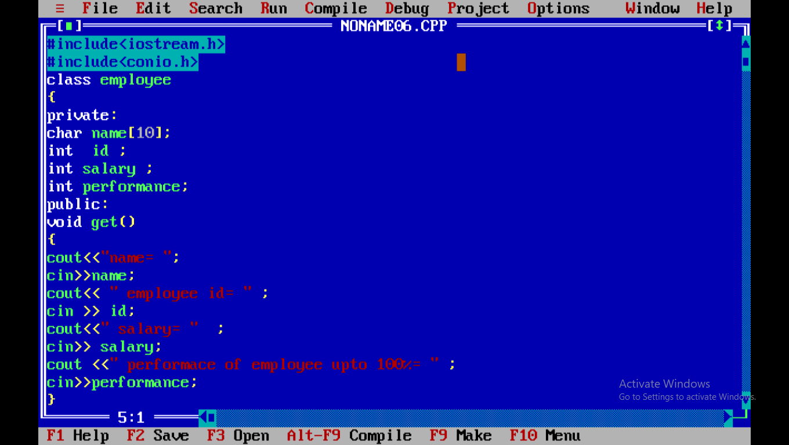
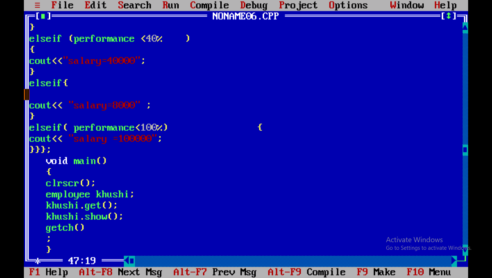

# Employee-Salary-Management-program
Employee Salary Management System in C++ to add, update, and display employee details and salaries efficiently.
# 💼 Employee Salary Management System

## 📖 Description
**Employee Salary Management System** is a **C++ console program** to efficiently manage employee details and salaries.  
Add, update, search, delete, and display employee information with a simple menu-driven interface.  

---

## ✨ Features
- ➕ **Add new employee** (ID, Name, Salary)
- 📋 **Display all employee records**
- 🔍 **Search employee by ID**
- ✏️ **Update employee salary**
- ❌ **Delete employee records**
- 🖥️ **User-friendly console interface**

---

## 🛠️ Technologies Used
- **C++**  
- Concepts: Classes & Objects, Functions, Loops, Conditional Statements  
- Optional: File Handling for persistent storage  

---

## ▶️ How to Run
1. Download or clone the repository.  
2. Open `EmployeeSalary.cpp` in a **C++ IDE** (Turbo C++, Code::Blocks, Dev C++, etc.).  
3. **Compile and run** the program.  
4. Follow the **on-screen menu** to manage employees.  

---

## 💻 Sample Code
```cpp
#include <iostream>
using namespace std;

class Employee {
    int id;
    char name[50];
    double salary;
public:
    void getDetails() {
        cout << "Enter ID: "; cin >> id;
        cout << "Enter Name: "; cin.ignore(); cin.getline(name, 50);
        cout << "Enter Salary: "; cin >> salary;
    }
    void showDetails() {
        cout << "ID: " << id << "\nName: " << name << "\nSalary: " << salary << endl;
    }
};
------
EmployeeSalaryManagement/
│
├── EmployeeSalary.cpp        # Main C++ program
├── README.md                # Project description
└── data.txt (optional)      # Employee data storage
------
##firstsection of code

##secondsection of code

##thirdsection of code


